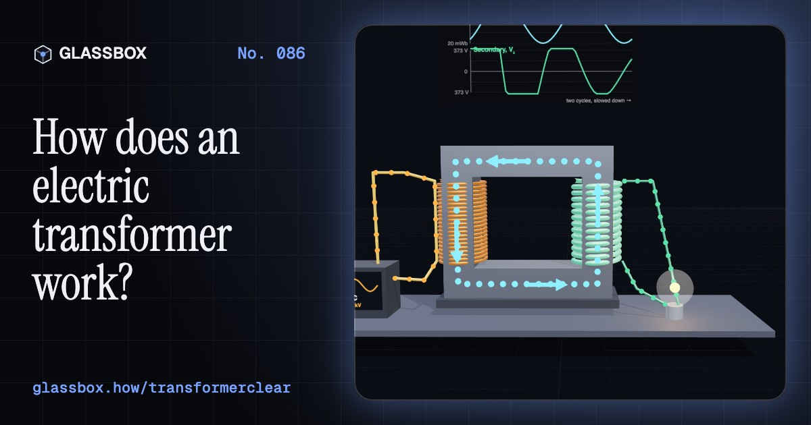
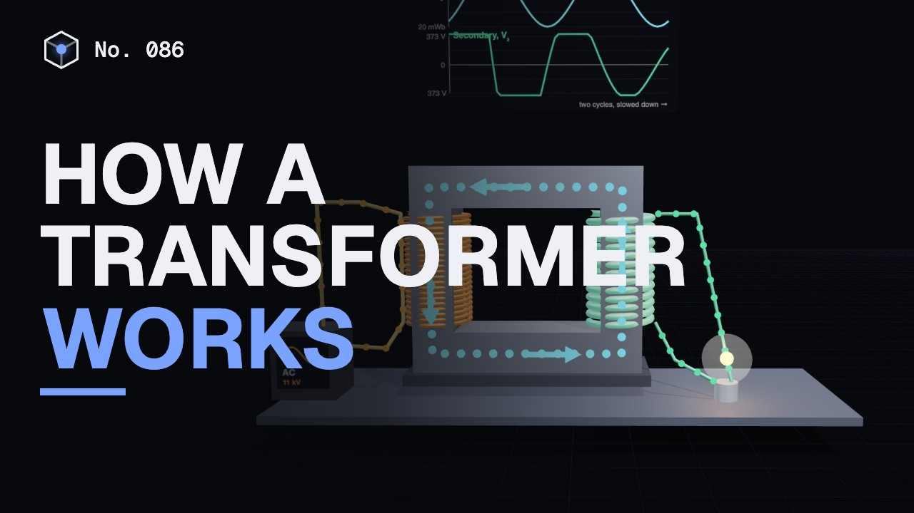
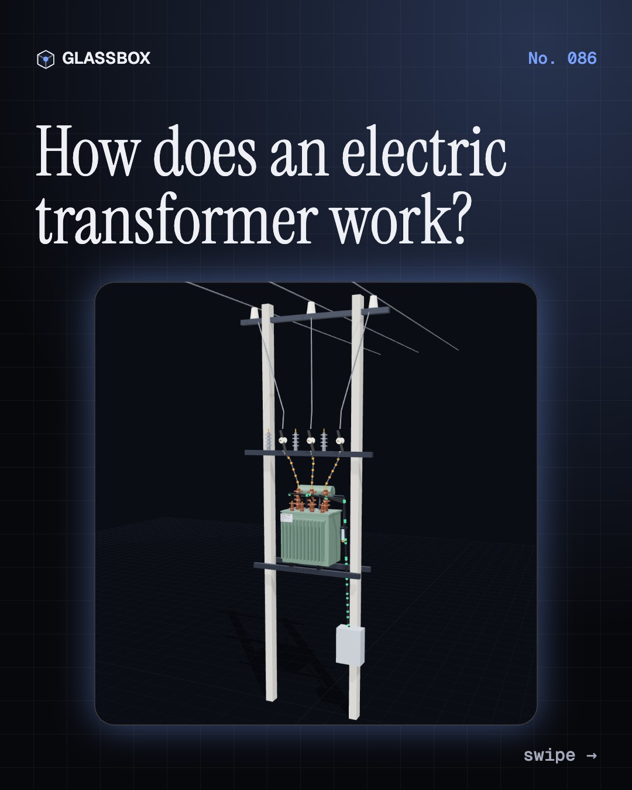
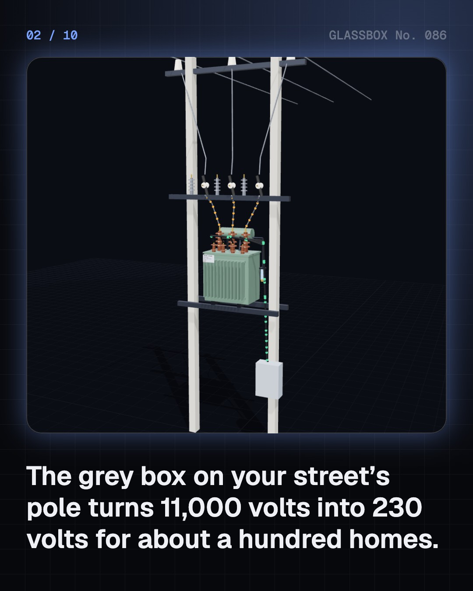
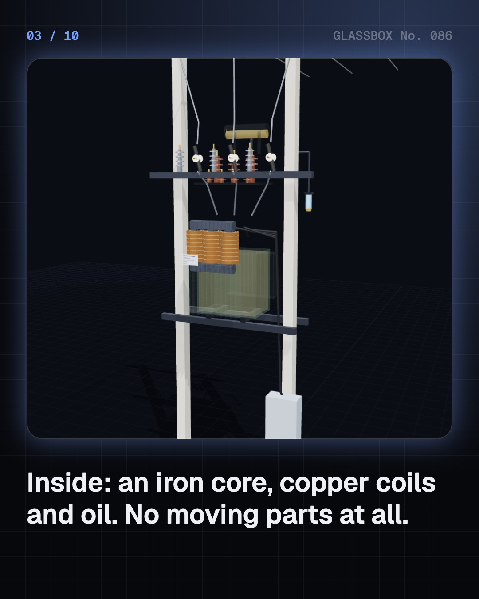
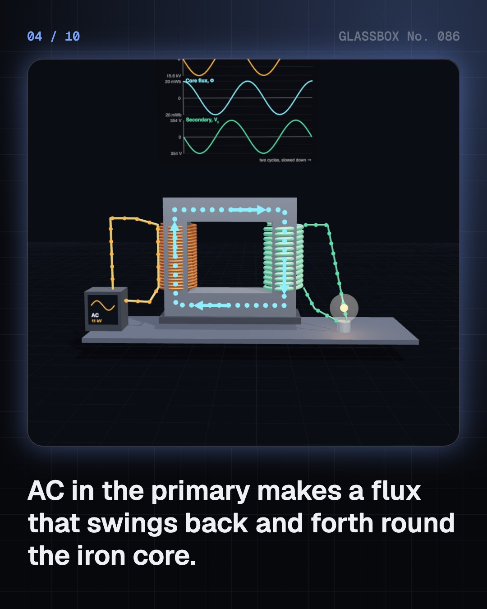

<!-- glassbox:start -->
<!-- Generated from glassbox.json by the Glassbox hub (npm run readme -- transformerclear). Edit glassbox.json, not this block. -->
<p align="center"><a href="https://glassbox-production-fd52.up.railway.app/e/transformerclear/"></a></p>

<h1 align="center">TransformerClear</h1>

<p align="center"><b>How does an electric transformer work?</b><br>The grey box on your street's pole has no moving parts, yet it turns 11,000 volts into the 230 volts in your socket. Open one up in 3D, watch the flux swing through its iron core, and follow the power from a 400 kV line to your phone charger.</p>

<p align="center"><a href="https://glassbox-production-fd52.up.railway.app/transformerclear/"><b>▶ Play with it</b></a> &nbsp;·&nbsp; <a href="https://glassbox-production-fd52.up.railway.app/e/transformerclear/">Read the 60-second explainer</a> &nbsp;·&nbsp; <a href="https://glassbox-production-fd52.up.railway.app/transformerclear/glassbox/reel.mp4">Watch the 40-second video</a></p>

<p align="center">
  <a href="https://glassbox-production-fd52.up.railway.app/e/transformerclear/"></a>
  <a href="https://glassbox-production-fd52.up.railway.app/e/transformerclear/"></a>
  <a href="LICENSE"></a>
  <a href="LICENSE-CONTENT.md"></a>
  <a href="#privacy"></a>
</p>

## In 60 seconds

1. **Two coils, one iron core.** A transformer is two coils of wire wound on a core of thin steel sheets. AC in the first coil makes a magnetic flux that swings back and forth 50 times a second round the core, and that changing flux induces a voltage in the second coil. The coils never touch.
2. **Turns set the voltage.** Every turn on the core feels the same volts, so V₂ ÷ V₁ = N₂ ÷ N₁. The pole transformer on an Indian street has about 2,464 turns on its 11 kV side and 56 on its 250 V side. Power in ≈ power out, so when the voltage goes down 44 times, the current goes up 44 times. On DC the flux stops changing and nothing comes out.
3. **Step up, then step down.** A power station's 21 kV is stepped up to 400 kV so the long lines carry little current and lose little as I²R heat. Substations step it down, 220, 132, 33, 11 kV, and the pole transformer makes 433 V (230 V per phase). A phone charger's SMPS does the last step at about 65 kHz with a fingernail-sized core.
4. **Where the 1–2% goes.** Core loss (hysteresis and eddy currents in the steel) is there all day; thin 0.27 mm laminations and amorphous metal keep it small. Copper loss grows with the load squared. Hot oil rises past the coils, cools in the radiator fins and sinks back. India's BEE star label rates transformers by their losses.
5. **Three phases, delta and star.** The pole transformer is delta on the 11 kV side and star on the 433 V side. From any phase to the star point, the neutral, you get about 230 V; between two phases, √3 × 230 ≈ 400 V. Balanced loads cancel in the neutral; the neutral carries only the imbalance.
6. **Heat, faults and safety.** Overload on a hot night and the windings' paper insulation ages twice as fast for every 6 °C above 98 °C. Inside faults make gas, which a Buchholz relay catches to sound an alarm or trip. Never climb a transformer structure or open its box: if you see smoke or leaking oil, keep away and call the electricity helpline.

## Words worth knowing

| Term | Meaning |
|---|---|
| **Mutual induction** | A changing current in one coil makes a voltage in another coil that shares its magnetic flux. |
| **Turns ratio** | N₂ ÷ N₁, the ratio of secondary to primary turns. It sets the voltage ratio, and the current ratio the other way round. |
| **EMF equation** | E = 4.44 f N Φmax: the rms voltage of a coil of N turns carrying a sine-wave flux of peak Φmax at frequency f. |
| **CRGO steel** | Cold-rolled grain-oriented silicon steel, whose lined-up crystals let flux flow easily along the sheet. |
| **Eddy currents** | Swirls of current induced inside the core itself; thin insulated laminations keep them small. |
| **Core and copper loss** | Core loss is wasted in the steel whenever the transformer is on; copper loss is I²R heat in the windings and grows with load squared. |
| **Delta and star** | Two ways to join three coils: in a triangle (delta, no neutral) or at one common point (star, with a neutral). |
| **ONAN cooling** | Oil natural, air natural: hot oil rises and cool oil sinks through the radiator fins with no pump or fan. |
| **Buchholz relay** | A device in the pipe to the conservator that detects gas and oil surges from faults inside the tank. |

## A short history

**Nearly two centuries from Faraday's iron ring to the 1,200 kV giants tested in Madhya Pradesh.**

- **1831** · Faraday's induction ring (Michael Faraday, Royal Institution, London, England)
- **1882** · Gaulard and Gibbs's secondary generator (Lucien Gaulard and John Dixon Gibbs, London, England)
- **1885** · A closed core, and the word “transformer” (Károly Zipernowsky, Ottó Bláthy and Miksa Déri, Ganz Works, Budapest, Hungary)
- **1886** · Great Barrington lights up (William Stanley Jr., for George Westinghouse, Great Barrington, Massachusetts, USA)
- **1888** · The war of the currents (Thomas Edison against George Westinghouse and Nikola Tesla, USA)
- **1891** · Three-phase power crosses 175 km (Mikhail Dolivo-Dobrovolsky, AEG and Oskar von Miller, Lauffen am Neckar to Frankfurt, Germany)
- **1902** · Sivasamudram to the Kolar Gold Fields (Mysore State: Dewan K. Seshadri Iyer and engineer A. C. Joly de Lotbinière, Shivanasamudra Falls to Kolar Gold Fields, Karnataka, India)
- **1921** · The Buchholz relay (Max Buchholz, Kassel, Germany)

The full story, with 30 moments, charts, people and 40 sources: [glassbox.how/e/transformerclear/history](https://glassbox-production-fd52.up.railway.app/e/transformerclear/history/). The data lives in [`history.json`](history.json).

## Video and slides

Made with the Glassbox studio from this box's storyboard (`window.glassbox.director`). Free to reuse under CC BY 4.0.

<a href="https://glassbox-production-fd52.up.railway.app/transformerclear/glassbox/video.mp4"></a>

<p><a href="glassbox/slide-1.jpg"></a> <a href="glassbox/slide-2.jpg"></a> <a href="glassbox/slide-3.jpg"></a> <a href="glassbox/slide-4.jpg"></a></p>

| File | What | Size |
|---|---|---|
| [`glassbox/reel.mp4`](https://glassbox-production-fd52.up.railway.app/transformerclear/glassbox/reel.mp4) | Reel / Short, with captions and soundtrack | 1080×1920 |
| [`glassbox/video.mp4`](https://glassbox-production-fd52.up.railway.app/transformerclear/glassbox/video.mp4) | YouTube video, with captions and soundtrack | 1920×1080 |
| `glassbox/slide-1…10.jpg` | Instagram carousel | 1080×1350 |
| `glassbox/thumb.jpg` | YouTube thumbnail | 1280×720 |
| `glassbox/cover.jpg` | Share card and repo social preview | 1200×630 |
| [`glassbox/history-reel.mp4`](https://glassbox-production-fd52.up.railway.app/transformerclear/glassbox/history-reel.mp4) | “History in 10 moments” Reel / Short | 1080×1920 |
| `glassbox/history-slide-*.jpg` | History carousel | 1080×1350 |
| `glassbox/post.json` | Post copy and schedule used by the publish kit | |

## Privacy

This box has no accounts and no ads, and it ships its own fonts and libraries. When you run it yourself it sends nothing anywhere. On glassbox.how, the site's `/bar.js` also loads Glassbox's analytics: **Google Analytics** to count visits (it asks first in the EU, UK and Switzerland, and stays off when your browser sends Global Privacy Control or Do Not Track) and **ClickTrust** to detect bots.

It remembers a few things **in your own browser only**, and never sends them anywhere:

| Browser storage key | What it holds |
|---|---|
| `transformerclear.v1` | Which chapters you have opened, your best quiz scores, and sound on or off. |

Exactly what each one sees is at [glassbox.how/privacy](https://glassbox-production-fd52.up.railway.app/privacy/).

## Licences

- **Code:** [MIT](LICENSE). Use it, change it, ship it.
- **Explanations, text, images and videos** (`glassbox.json`, `glassbox/`): [CC BY 4.0](LICENSE-CONTENT.md). Credit “Glassbox, glassbox.how/e/transformerclear”.
- **Third-party parts** keep their own licences: [three.js](https://threejs.org) (MIT), [Geist, Instrument Serif](https://openfontlicense.org) (SIL OFL 1.1).
- The Glassbox name and logo aren't covered by either licence. See the [terms](https://glassbox-production-fd52.up.railway.app/terms/).

Found a mistake? [Open an issue](https://github.com/bdeeps/transformerclear/issues). Corrections happen in public.
<!-- glassbox:end -->

## Run it

It's plain HTML, CSS and JavaScript. No build step and no dependencies. Run locally, it contacts no other website.

```bash
python3 -m http.server 8000
```

Three.js and the fonts ship in `vendor/` and `fonts/`, so it also works offline.

Then open http://localhost:8000.

## How it's built

| File | What |
|---|---|
| `index.html`, `css/app.css` | The page and its styles |
| `js/app.js`, `js/stage.js`, `js/ui.js`, `js/kit.js` | The shared Glassbox 3D engine: chapters, 3D stage, controls, quiz, video director |
| `js/chapters/*.js` | One file per chapter: the 3D model, controls, text, key terms, quiz and video scenes |
| `js/transformer.js` | TransformerClear's shared physics and parts: the 100 kVA 11 kV / 433 V pole transformer's turns and flux, IS 1180 loss limits, core-loss and IEC 60076-7 heat-rise models, charts, flowing dots, and 3D models of the tank, core, windings, bushings, conservator, breather and pole structure |
| `glassbox.json` | Title, question, explainer beats, key terms, browser storage and credits shown on glassbox.how |
| `reel` in each chapter | The storyboard the Glassbox studio records into short videos |
| `glassbox/` | The published video, slides, thumbnail and post copy |
| `fonts/`, `vendor/three/` | Self-hosted Geist and Instrument Serif (SIL OFL 1.1) and three.js (MIT) |
